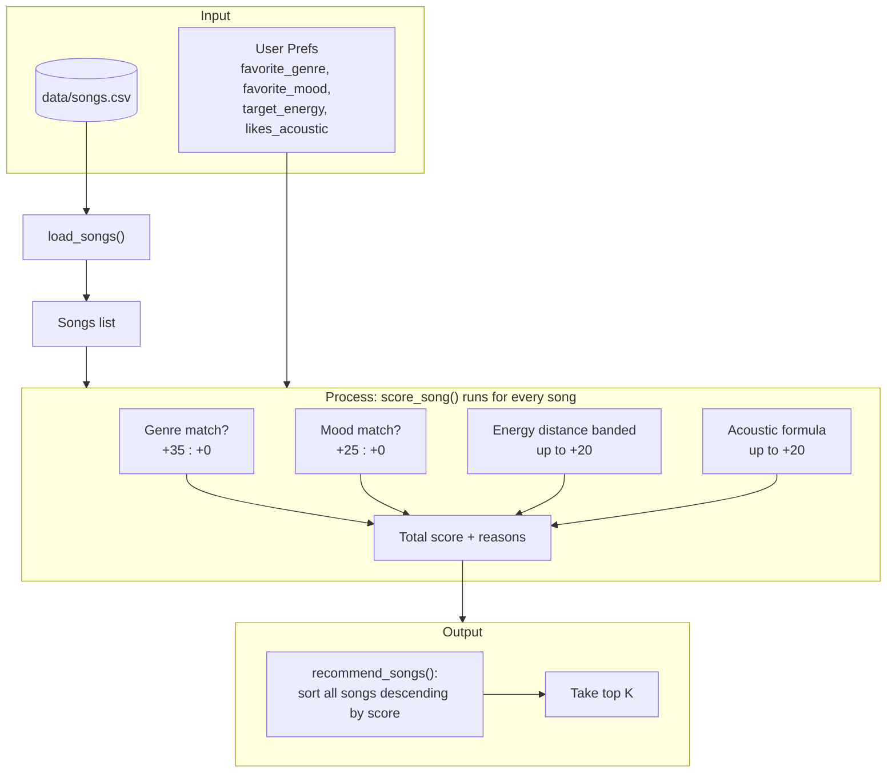

# Recommender Data Flow

Input (User Prefs) → Process (score every song) → Output (ranked Top K).

```mermaid
flowchart TD
    subgraph INPUT["Input"]
        CSV[("data/songs.csv")]
        PREFS["User Prefs<br/>favorite_genre, favorite_mood,<br/>target_energy, likes_acoustic"]
    end

    CSV --> LOAD["load_songs()"]
    LOAD --> SONGS["Songs list"]

    subgraph PROCESS["Process: score_song() runs for every song"]
        direction TB
        G1["Genre match?<br/>+35 : +0"]
        G2["Mood match?<br/>+25 : +0"]
        G3["Energy distance banded<br/>up to +20"]
        G4["Acoustic formula<br/>up to +20"]
        G1 & G2 & G3 & G4 --> SUM["Total score + reasons"]
    end

    SONGS --> PROCESS
    PREFS --> PROCESS

    subgraph OUTPUT["Output"]
        SORT["recommend_songs():<br/>sort all songs descending by score"]
        TOPK["Take top K"]
        SORT --> TOPK
    end

    SUM --> OUTPUT
```
